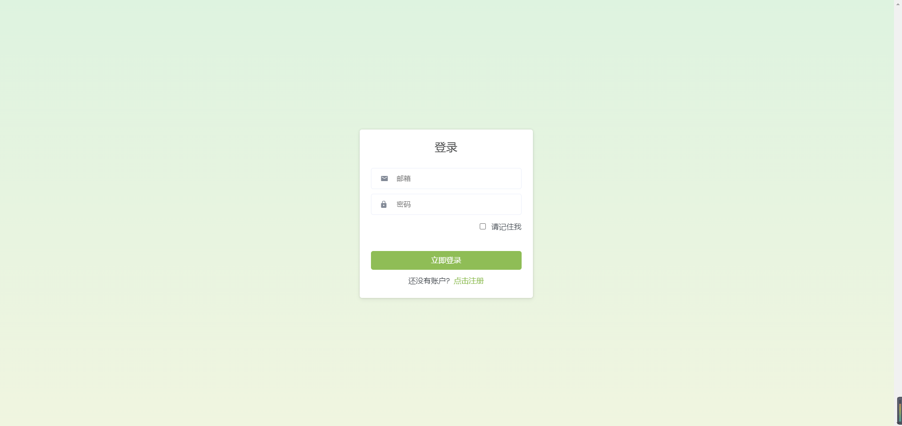
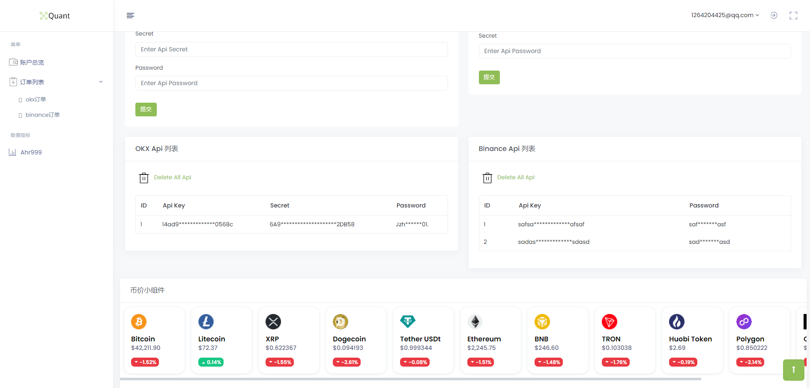

# Quantitative Trading Backend Based on Django
[English](./README.md) | [简体中文](./README_ZH.md)

---


---
**As this project is in its early stages, the code quality may not be high. Efforts will be made to optimize it over time, with the goal of restructuring it into a React+FastAPI front-end and back-end separated project.**
## Project Introduction
This project is a quantitative trading backend based on Django, featuring the following functionalities:
- [x] Support for viewing prices of popular cryptocurrencies.
- [x] Market data viewing, currently including Ahr999.
- [x] Multi-account API management, with current support for OKX, and future plans to include other exchanges such as Binance.
- [x] Ability to view account transaction history and export it to Excel.

### TODO
- [ ] Refactor the project into a front-end and back-end separated structure using React+FastAPI+PostgreSQL.
- [ ] Implement cloud-based alert services (such as DingTalk, Telegram, Lark, etc.).
- [ ] Add support for viewing more market data.
- [ ] Manage APIs for more exchanges.

## Project Screenshots
### 1.Login Page

### 2.Home Page

### 3.Order Viewing

### 4.Data Viewing


## Project Deployment
### 1.Install Dependencies
```
pip install -r requirements.txt
```
### 2.Modify Configuration File
```
vim quant/settings.py
# Modify database configuration according to requirements
```
### 3.Migrate Database
```
python manage.py makemigrations
python manage.py migrate
```
### 4.Create Super User
```
python manage.py createsuperuser
```
### 5.Start Project
```
python manage.py runserver
```
### 6.Access Project
```
http://localhost:8000
```

