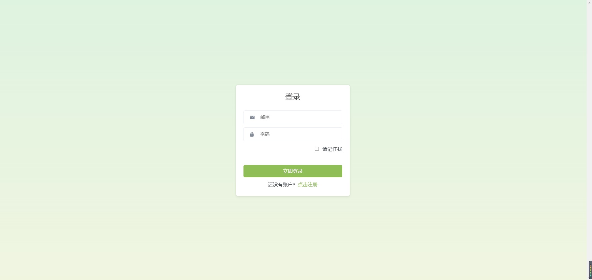
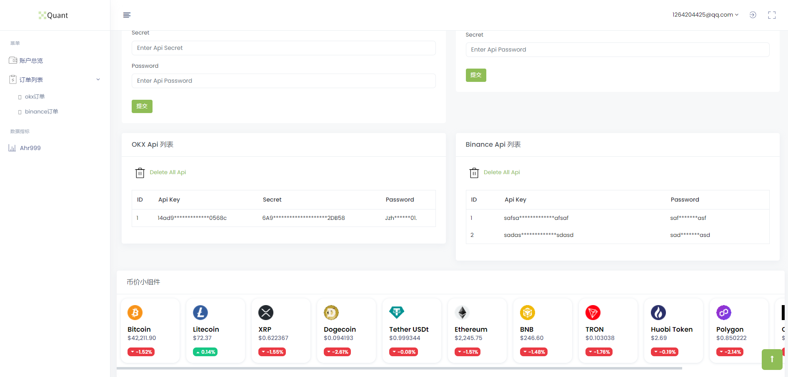
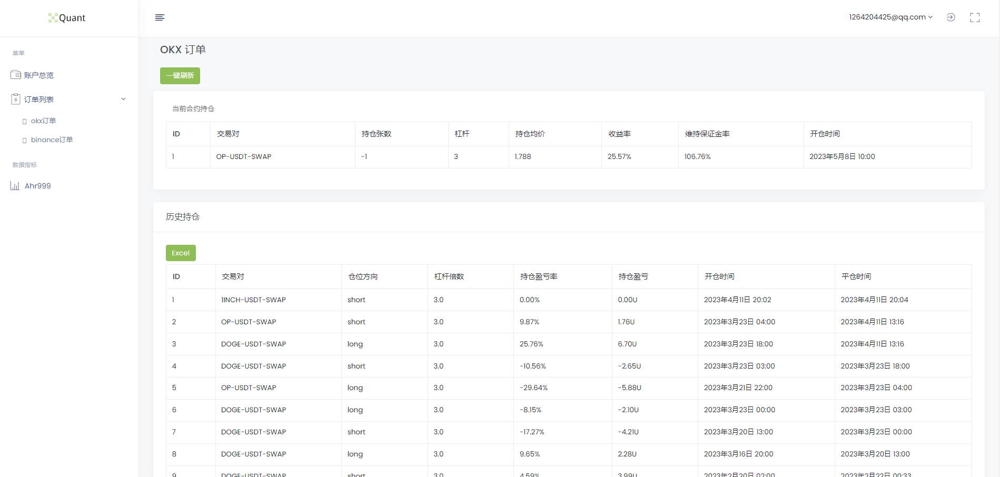
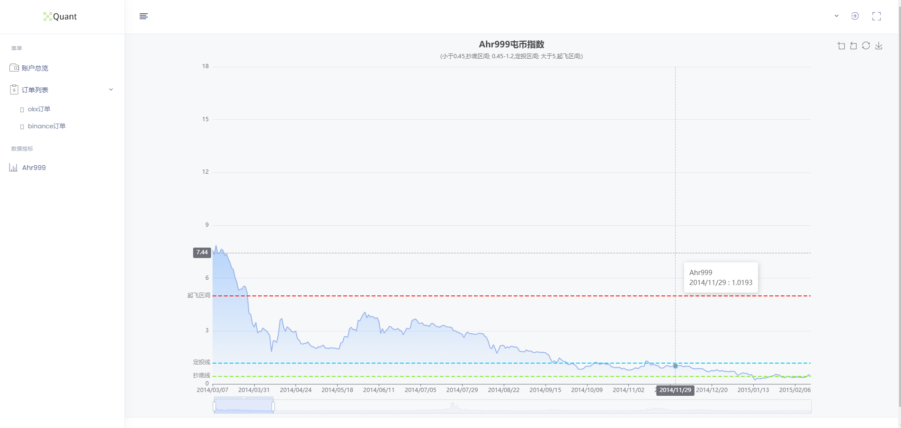

# 基于Django的量化交易后台
[English](./README.md) | 简体中文(./README.md)

---


---
**由于本项目属于早期项目，所以代码质量不高，后续如有时间逐步优化，重构为React+FastAPI的前后端分离项目**
## 项目介绍
本项目是基于Django的量化交易后台，主要包括以下功能：
- [x] 支持热门币种价格查看
- [x] 支持市场数据查看，目前有Ahr999
- [x] 支持多账户API管理,目前已经支持OKX,后续将支持Binance等交易所
- [x] 支持查看帐户历史交易记录，并且可以导出为excel

### TODO
- [ ] 项目重构为前后端分离项目React+FastAPI+PostgreSQL
- [ ] 提供云端警告服务（如钉钉，Telegram，飞书等）
- [ ] 支持更多市场数据查看
- [ ] 支持更多交易所API管理

## 项目截图
### 1.登录页面

### 2.首页

### 3.订单查看

### 4.数据查看


## 项目部署
### 1.安装依赖
```
pip install -r requirements.txt
```
### 2.修改配置文件
```
# 修改数据库配置
vim quant/settings.py
# 更具要求修改数据库配置
```
### 3.迁移数据库
```
python manage.py makemigrations
python manage.py migrate
```
### 4.创建超级用户
```
python manage.py createsuperuser
```
### 5.启动项目
```
python manage.py runserver
```
### 6.访问项目
```
http://localhost:8000
```
